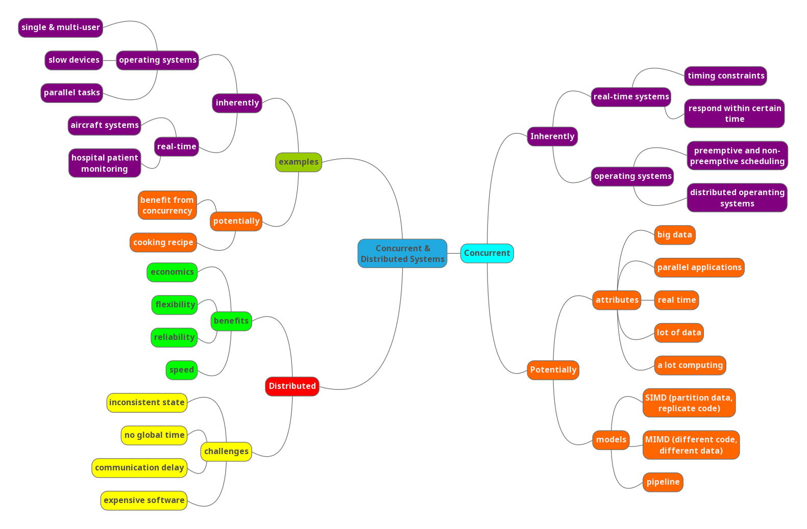
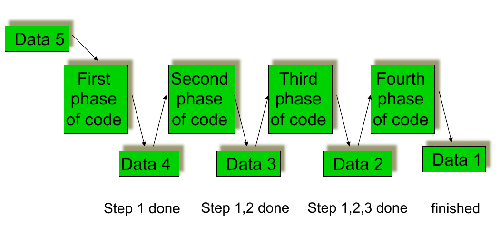
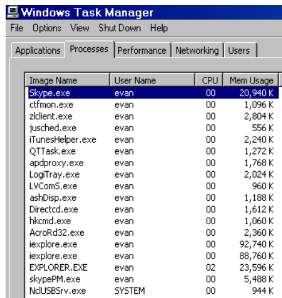
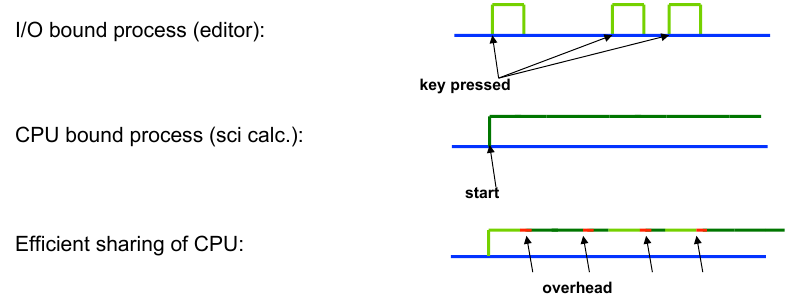
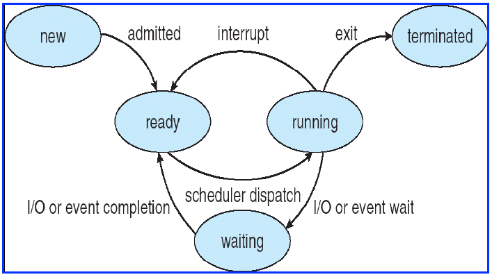
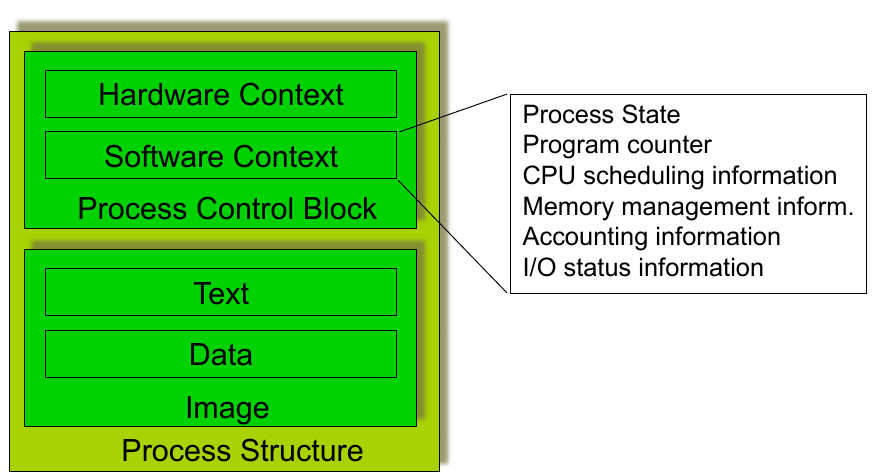
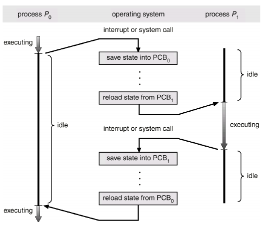
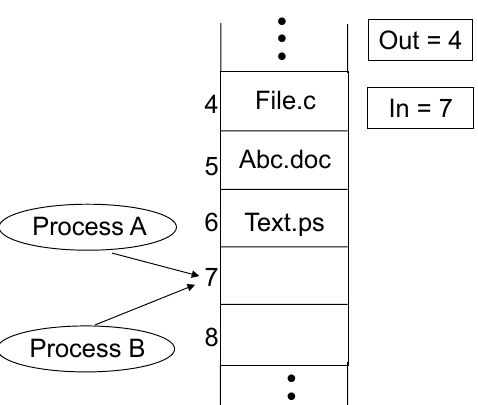

# CSCU9V5 - Concurrent & Distributed Systems

[TOC]

# Concurrent system classifications & examples

## Mindmap




## Inherently concurrent systems

### Real-time systems

- timing constraints dictated by the environtment of a system
- system has to respond to external events within a certain time
- Software monitors & controls aspects of the environment of the system
- Examples:

  - aircraft systems
  - hospital patient monitoring

### Operating systems

- Single user and multi-user systems
- Devices are slow compared to the main processor
  - OS attends to the devices when necessary
  - Other tasks are performed while devices are busy
- User want to carry out a number of tasks in parallel (lengthy computation + reading e-mail)
- Running programs of different users in parallel
- Preemtive and non-premtive scheduling
- Distributed operating systems

## Potentially concurrent systems

- benefits from concurrency
- Used for:
  - large amount of computing (graphics)
  - large amount of data to be processed (simulations)
  - Real-time requirement for the result (voice processing)
  - Hardware is available to run applications in parallel
  - Big data problems
- Examples
  - eg cooking recipe
    - can be executed  sequentially
    - some steps can be carried out simultaneously
    - ingredients for the next step need to be ready
- Concurrency solutions (various models)
  - partition data, replicate code (SIMD)
    - 
  - different code on different data (MIMD)
  - pipeline
    - 


## Distrubited systems

### Benefits

|      |      |
| ---- | ---- |
| Economics             | Data sharing   |
| Speed                 | Device sharing |
| Inherent distribution | Communication  |
| Reliability           | Flexibility    |
| Incremental Growth    | Transparency   |

### Challenges

|      |      |
| ---- | ---- |
| Expensive software        | Communcation delay |
| Scalability/Overhead      | Incosistent state  |
| Security                  | No global time     |
| Indepedent fauilure nodes | Heterogeneity      |

# Processes

## About processes

### Execution of a process

- Informally: a program in execution

- computer execute predefined actions

  - Actions are specified by a program
  - Program is a self-contained entity

- Execution of a program required resources

  - e.g.: CPU
    - running programs compete for CPU
    - Programs do not know when they get the CPU

- Actions of CPU and program logic are unrelated

- Conclusion

  - CPU is a normal reusable resource

  - for easy managing of running programs (take the view of the program, not he CPU)

  - Abscration of running programs is required

### Processes - an operating system abstraction

- A program is a static text that specifies a range of actions which have to be executed by one or more processors (passive entity)

- A process is an entity executing the range of actions, which are specified by the program. Its thread of execution is somewhere in the middle between the first and the last of the actions specified by the program (active entity)

  

### Life cycle of a process

- Number of processes > number of CPUs

- Some processes cannot run

- Processes waiting for the resurouces

  - CPU (ready processes)
  - Other resources (blocked processes)

- Operating system provides for liveliness

  - state transitions of a process

#### Multitasking

- The OS virtual machine can (in effect) run several programs at the "same" time

- Efficient usage of CPU:

  - 

#### Process states

  - initiated:	the process is being created

  - running: 	instructions are being executed

  - waiting: 	 	the process is waiting for an event to occur

  - ready: 	 	the process is waiting to be assigned

  - terminated: 	the process has finished execution

#### Lifecycle



- **new** process is created and put in the **ready** queue
- then the use of the CPU is assigned to a ready process, which becomes **running**
- a running process can either **terminate**, suspend while **waiting** for some event to occur or be forced to **release** the CPU (interrupted), for instance because it is being running for too long or because the OS has to load a new page in memory, and hence be put back to the ready queue
- a waiting process can eventually become **read** again, when the event it was waiting for occurs

## Process implementation

### Parts of a process



### Context switch



- when CPU switches to another process, the system must save the state of the old process and load the saved state for the new process
- context-swtich time is overhead; the system does no useful work while switching
- time dependent on hardware support

### Process creation and termination

##### Creation

- Parent process creates children processes, which in turn create other processes, forming a tree of processes

- Resource sharing

  - Parent and children share all resources
  - Children share subset of parent's resources
  - Parent and child share no resources

- Execution

  - Parent and children execute concurrently
  - Parent waits until children terminate

- Address space

  - Child duplicate of parent
  - Child has a program loaded into it

##### Termination

- Process executes last statement and asks the operating system to delete it
  - output data from child to parent
  - process' resources are deallocated by operating system (open files, physical and virtual memory, I/O buffers)
- Parent may terminate execution of children processes
  - child has exceeded allocated resources
  - task assigned to child is no longer required
  - Parent is exiting (eg.: OS may not allow child to continue of its parent terminates)

## Cooperating processes

- **Independent process** 
  - cannot affect or be affected by the execution of another process
- **Cooperating proccess**
  - can affect or be affected by the execution of another process
- Advanteges of process cooperation
  - information sharing (shared files)
  - computation pseed-up (split-up of a task into subtasksk and run them in parallel; note: number of processors)
  - Modulairty (dived a system into separate processes)
  - Convenience (a user has many tasks; eg printing, editing compiling)

### Producer - consumer problem

- Paradigm for cooperating processes, **producer** produces information that is consumed by a **consumer**
  - Examples: printer queue, keyboard buffer
  - Consumer and Producer processes need to be synchronised
  - Buffer may be provided by OS (IPC mechanism) or be explicitly coded by the programmer
    - **unbounded-buffer** places no practical limit on the buffer size
      - producer can always produce elements
      - consumer gets blocked when there are no elements
    - **bounded-buffer** assumes that there is a fixed buffer size
      - producer is blocked when the buffer is full
      - consumer is blocked when the buffer is empty

### Race conditions

- Concurrent access to shared data may result in data inconsistency
- Maintaining data consistency requires machanisms to ensure the orderly execution of cooperating processes
- Example: print spooler
  - User processes put file names into a spooler directory
  - Printer deamon periodically checkes for any new files in the spooler directory (if there are any print the file and remove file name from spooler directory)
  - Directory has infinite number of slots
  - Two globally available variables:
    - **out** points at the next file to be printed
    - **in** points at the next avaiable slot
  - At a time
    - slots 0-3 are empty (files printed)
    - slots 4-6 are full (files to be printed)
  - 
  - Almost simultaneously processes A and B want to print
  - Processes A reads in (value 7) and assigns it to a local variable
  - Processs context switch occurs to process B
  - Process B reads in (value 7) and stores a file in slot 7, updates in to 8
  - Process A runs again, continuing from where it stopped
  - Process A reads local variable and stores a file at slot 7
  - Process B's file erased
  - **RACE CONDITION**

## Summary

- process is an operating system abstraction (program in execution)
- One program may result in many processes
- Processes may be interupted while processing (process states)
- Processes cooperate (communicate)
- Race conditions

# Threads

## Overview

- so far implied that a process has ONE thread of execution

- Many OS have exnteded the process model to allow processes to have more than one thread of execution

- **Process scheduling** and context switching is heavyweight

- **Thread scheduling** and switching is lightweight

  

- Basic unit of CPU utilisation

- Comprises

  - thread ID
  - program counter
  - register set
  - stack

- Shares

  - code section
  - data section
  - open files, signals

- Problems with processes

  - many software applications are implemented in a single process with multiple threads of execution
  - Text processing
    - display graphics
    - get keystrokes from the user
    - perform spell checking
  - Web browsing
    - Display text/images
    - Retrive data from network
  - Web server
    - Single process - long wait for some requests
    - Create a process per request - enormous overhead
    - Create a thread per request

## Benefits

- **Responsiveness** - an application continues running even if part of it is blocked or performing a lengthy operation
- **Resource sharing** - threads share memory and resources of the process they belong to
- **Economy** - allocating memory and resources to processes is costly. Creating a switching between threads is more cost effective as overhead is smaller
- **Utilisation of multiprocesssor architectures** -  each thread may run on a different processor. In a single processor environment, the context switching allows pseudo parallelism

## Thread implementation

- Threads may be provided by a user library
  - Posix threads, Mach C-threads
  - Library supports creating, scheduling and management
  - OS kernel is unaware of user threads
  - Threads are fast to create and manage
  - But, if a thread performs a blocking system call => all threads are blocked
- Threads may be provided by the OS kernel
  - Windows NT, Solaris, Digital Unix
  - Generally slower to create and manage than user threads
  - Concurrent threads may proceed during a blocking system call
  - Kernel can schedule threads to run on different processors on a multiprocessor

## Multithreading models

- Systems provide for kernel and user threads
- different multithreading models

### Many-to-one model


- many user-level threads mapped to single kernel thread
- used on systems that do not support kernel threads

### One-to-one model


- each user-level thread maps to kernel thread
- creating a user thread requires creating a kernel thread
- examples:
  - Windows NT
  - OS/2

### Many-to-many model


- multiplexes many user-level threads to fewer or equal kernel threads
- examples:
  - solaris
  - irix
  - digital unix

## Threads in Java

### A Java thread

```java
class Worker1 extends Thread
{
	public void run() {
		System.out.println("I am a Worker Thread");
	}
}
```

- Extend the *Thread*
- Overwrite the *run()* method

### Initialising a thread
```java
public class First
{
    public static void main(String args[]) {
        Worker runner = new Worker1();
        runner.start();
        System.out.println("I am the main thread");
    }
}
```
- A thread is created by calling *start()*
  - memory is allocated
  - a new thread within the JVM is initialised
  - *run()* of the object  is called
- do not call *run()* yourself
- two threads are created: the application thread and the runner thread

### The runnable interface
```java
public interface Runnable
{
	public abstract void run();
}
```

- A thread can also be created by implementing the *Runnable interface*
- define the *run()* method
- Thread class also implements runnable, thus *run()* needs to be defined

### Initialising the runnable thread
```java
class Worker2 implements Runnable
{
    public void run() {
    	System.out.println(“I am a Worker Thread”);
    }
}
```
- Similar to extending the *Thread* class
- Initialising the new thread is slightly different to extending *Thread*
- No access to static or instance methods (such as *start()*) of Thread
- However, *start()* is needed

### Creating a thread
```java
public class Second
{
    public static void main(String args[]) {
        Runnable runner = new Worker2();
        Thread thrd = new Thread(runner);
        thrd.start();
        System.out.println(“I am the main thread”);
    }
}
```
- A new Thread object is created and the Runnable object is passed as parameter to its constructor
- Thread is created calling start()
- Execution begins in the run() method of Runnable object

- another example:
```java
public class OurApplet extends Applet implements Runnable {
    public void init() {
        Thread th = new Thread(this);
        th.start();
    }
    public void run() {
    	System.out.println(“I am a Worker Thread”);
    }
}
```

### Managing Java Threads

- **suspend()** - suspends execution of the currently running thread
  - applet (running seperate thread) displaying some graphics is not visible -> suspend the thread
- **sleep()** - puts the currently running thread to sleep for a specified amount of time
- **resume()** - resumes execution of a suspended thread
  - Applet is visible again -> resume the thread and processing
- **stop()** - stops execution of a thread
  - Thread cannot be resumed

### Thread states


### Producer-consumer problem

#### Server
```java
public class Server {
    public Server() {
        MessageQueue mailBox = new MessageQueue();
        Producer producerThread = new Producer(mailBox);
        Consumer consumerThread = new Consumer(mailBox);
        producerThread.start();
        consumerThread.start();
    }
    public static void main(String args[]) {
    	Server server = new Server();
    }
}
```

#### Producer
```java
class Producer extends Thread {
    public Producer(MessageQueue m) {
    	mbox = m;
    }
    public void run() {
        while (true) {
        	// produce an item & enter it into the buffer
        	Date message = new Date();
        	mbox.send(message);
        }
    }
    private MessageQueue mbox;
}
```

#### Consumer
```java
class Consumer extends Thread {
    public Consumer(MessageQueue m) {
    	mbox = m;
    }
    public void run() {
        while (true) {
            Date message = (Date)mbox.receive();
            if (message != null)
            // consume the message
        }
    }
    private MessageQueue mbox;
}
```

## Summary

- Threads are lightweight processes
- Allow for more efficient use of resources
- User and kernel threads - mappings
- Threads in Java language
  - extend the thread class
  - implement the runnable interface
- Threads can change states like processes

# Running in parallel - concurrency

## Example


## Process interactions

### General classification

#### One to one

- Appropiate in systems with static configurations of interactions between individual processes
- Example:
  - pipline in unix commands

#### Any to one 

- Multple clients interact with a single server
- Clients invoke a well known server
- Server accepts requests from any client
- Server does not know which client will interact next, waits for the next client
- Example:
  - Mail server + client
  - Web server + client

#### Any to (one of) many 

- Service offered by anonymous server processes
- Clients requests service from any available server
- This style usually reduces to one of the other styles

#### One to (one of) many 

- User to notify a set of interested clients
- Broadcast (sent out to everyone)
  - Usually no record of reception of communication
  - Clients liseten for information
- Multicast (sent out to a specific set of recipients)
  - How to identify the recipients (clients join a list - mailing list)
  - Reliable, unreliable (like broadcast)
  - Used in fault tolerant systems


#### Many to many 

- Usually implemented by shared data
- Any number of processes can interact
- Requires synchronisation to prevent chaos

### Forms of process interactions

- Co-operation (shared memory) 
- Communication (message passing) 

#### Implementing IPC

- Shared memory
  - Processes/threads involved share a common buffer pool
  - Buffer can be explicitly implemented by programmer
- Inter-Process Communication (IPC) without shared memory:
  - IPC has at least two operations
    - send (message)
    - receive (message)
  - messages can be either fixed or variable size
  - A link between the involved processes must exist
- Physical implementation
  - shared memory
  - hardware bus
  - network
- Logical implementation of **link**, **send()**, **receive()**:
  - direct or indirect communication
    - naming; processes need to have a way to indentify each other
  - Synchronisation: blocking or non-blocking send/receive
  - Automatic or explicit buffering
  - send by copy or send by reference
  - fixed-sized or variable-sized messages

#### Logical implementation

##### Direct communication

- processes need to explicitly name the receptionist / sender (synchronous adressing)
  - send(P, message)
  - receive(Q, message)
- Link is established automatically between the two parties; processes only need to know each other
- A link is established between exactly two processes
- Between each pair of processes there exists exactly one link
- Also asynchronous addressing possible
  - send(P, message) - send a message to process P
  - receive(id, message) - receive a message from any process; id holds the name of the processes with which communication took place
- Disadvantage: limited modularity (changing code)

##### Indirect communication

- Messages are send to **mailboxes** or **ports**
- Mailbox is an abstract concept
  - object into which messages can be included and removed
  - each mailbox has its unique identification
- Processes can communicate with other processes via different mailboxes
- Communcating processes need to have shared mailboxes
  - send(A, message) - send a message to mailbox A
  - receive(A, message) - receive a message from mailbox A
- A link is only established if the processes share a mailbox
- A link may be established between more than two processes
- Between a pair of processes there may be any number of links represented by different mailboxes
- How are messages linked to processes:
  - allow only links between two processes
  - allow at most one process at a time to execute receive()
  - allow the system to select which process will receive the message; the system may identify the receiver to the sender
- Mailboxes may be owned by
  - a user process
    - owner process may only receive messages
    - other processes (users) may only send messages
    - when the owner dies, the mailbox disappears too
    - users need to be notified of the disappearance of the mailbox
  - the operating system
    - independent, not associated with any process
    - operating system offers machanisms for
      - creating a new mailbox
      - send and receive messages
      - delete a mailbox

##### Synchronisation

- Message passing may be blocking or non-blocking (synchronous and asynchronous)
- Send
  - **Blocking** - sending process is blocked until the message has be received by the receiving process or mailbox
  - **Non-blocking** - sending process resumes operation immediately after sending the message
- Receive
  - **Blocking** - the receiving process blocks until a message has been received
  - **Non-blocking** - the receiver retrieves a valid message or a NULL message

##### Buffering

- Messages exchanged always reside in a temporary queue
- Zero capacity
  - maximum length 0 -> no messages can 'wait' in the queue
  - sender must block until the receiver gets the message
  - also called a message passing system without a buffering
- Bounded capacity
  - finite length n -> the queue can hold at most n messages
  - queue not full: message is stored in the queue (either a copy or a ref); sender can continue execution without waiting
  - queue full: sender blocks until space is available
- Unbounded capacity
  - potentially infinite length
  - sender never blocks

- Example - Message queue
```java
import java.util.*;
public class MessageQueue
{
    public MessageQueue() {
        queue = new Vector();
    }
    public void send(Object item)
    {
        queue.addElement(item);
    }
    public Object receive() {
        Object item;
        if (queue.size() == 0)
            return null;
        else {
            item = queue.firstElement();
        queue.removeElementAt(0);
        return item;
        }
    }
    private Vector queue;
}
```

- Message queue for producer consumer example from lecture 3
- Buffer is unbounded and provided by Vector class
- send() and receive() are non-blocking
- Consumer need to evaluate the result from receive() - message may be NULL

##### Shared memory

- Useful when:
  - In an upproteceted system where all processes and OS run in the same address space (MACOS until 7.5)
  - The language system operates a simple OS (Ada, ML)
  - In systems where multithreading is provided above the OS (Sun LWT library)
- Not useful wheh:
  - In protected systems where processes run in seperate address spaces
    - protection and addressing are orthogonal
  - Between processes on different CPUs or machines
    - However distributed shared memory
  - In systems where high flexibility is required
    - distribute process on different machines not possible
  - In systems where process migration is desirable
    - migration and shared memory are incompatible
    - however distributed shared memory

## Summary

- Process communications (1:1, 1:m, ...)
- Shared memory - direct communication
- Synchronisation (blocking/non-blocking)
- Buffers (0, finite, ...)