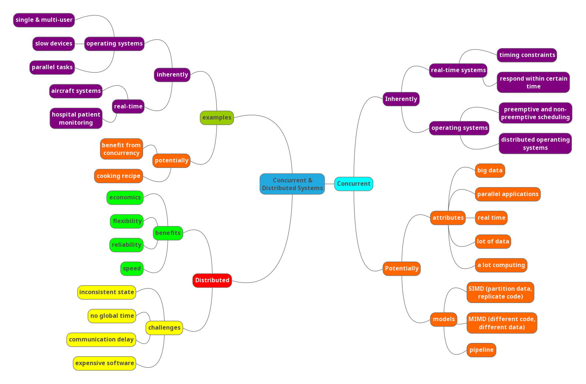

# CSCU9V5 - Concurrent & Distributed Systems

## Mindmap

# Concurrent systems

- Inherently concurrent systems

  - real-time systems
    - timing constraints dictated by the environtment of a system
    - system has to respond to external events within a certain time
    - Software monitors & controls aspects of the environment of the system
    - Examples:

      - aircraft systems
      - hospital patient monitoring

  - operating systems
    - Single user and multi-user systems
    - Devices are slow compared to the main processor
      - OS attends to the devices when necessary
      - Other tasks are performed while devices are busy
    - User want to carry out a number of tasks in parallel (lengthy computation + reading e-mail)
    - Running programs of different users in parallel
    - Preemtive and non-premtive scheduling
    - Distributed operating systems

- Potentially concurrent systems

  - benefits from concurrency
  - Used for:
    - large amount of computing (graphics)
    - large amount of data to be processed (simulations)
    - Real-time requirement for the result (voice processing)
    - Hardware is available to run applications in parallel
    - Big data problems
  - Examples
    - eg cooking recipe
      - can be executed  sequentially
      - some steps can be carried out simultaneously
      - ingredients for the next step need to be ready
  - Concurrency solutions (various models)
    - partition data, replicate code (SIMD)
      - 
    - different code on different data (MIMD)
    - pipeline
      - 

# Distrubited systems

## Benefits

| Economics             | Data sharing   |
| --------------------- | -------------- |
| Speed                 | Device sharing |
| Inherent distribution | Communication  |
| Reliability           | Flexibility    |
| Incremental Growth    | Transparency   |

## Challenges

| Expensive software        | Communcation delay |
| ------------------------- | ------------------ |
| Scalability/Overhead      | Incosistent state  |
| Security                  | No global time     |
| Indepedent fauilure nodes | Heterogeneity      |

