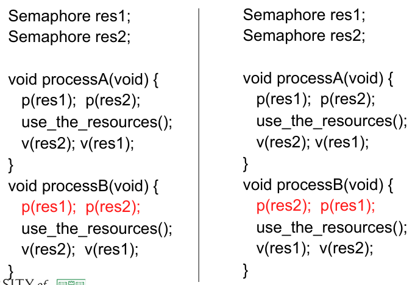

# CSCU9V5 - Concurrent & Distributed Systems

[TOC]

# Concurrent system classifications & examples

## Mindmap


## Inherently concurrent systems

### Real-time systems

- timing constraints dictated by the environment of a system
- system has to respond to external events within a certain time
- Software monitors & controls aspects of the environment of the system
- Examples:

  - aircraft systems
  - hospital patient monitoring

### Operating systems

- Single user and multi-user systems
- Devices are slow compared to the main processor
  - OS attends to the devices when necessary
  - Other tasks are performed while devices are busy
- User want to carry out a number of tasks in parallel (lengthy computation + reading e-mail)
- Running programs of different users in parallel
- Preemptive and non-preemptive scheduling
- Distributed operating systems

## Potentially concurrent systems

- benefits from concurrency
- Used for:
  - large amount of computing (graphics)
  - large amount of data to be processed (simulations)
  - Real-time requirement for the result (voice processing)
  - Hardware is available to run applications in parallel
  - Big data problems
- Examples
  - eg cooking recipe
    - can be executed  sequentially
    - some steps can be carried out simultaneously
    - ingredients for the next step need to be ready
- Concurrency solutions (various models)
  - partition data, replicate code (SIMD)
    - 
  - different code on different data (MIMD)
  - pipeline
    - 


## Distributed systems

### Benefits

|      |      |
| ---- | ---- |
| Economics             | Data sharing   |
| Speed                 | Device sharing |
| Inherent distribution | Communication  |
| Reliability           | Flexibility    |
| Incremental Growth    | Transparency   |

### Challenges

|      |      |
| ---- | ---- |
| Expensive software        | Communication delay |
| Scalability/Overhead      | Inconsistent state |
| Security                  | No global time     |
| Independent failure nodes | Heterogeneity      |

# Processes

## About processes

### Execution of a process

- Informally: a program in execution

- computer execute predefined actions

  - Actions are specified by a program
  - Program is a self-contained entity

- Execution of a program required resources

  - e.g.: CPU
    - running programs compete for CPU
    - Programs do not know when they get the CPU

- Actions of CPU and program logic are unrelated

- Conclusion

  - CPU is a normal reusable resource

  - for easy managing of running programs (take the view of the program, not he CPU)

  - Abscration of running programs is required

### Processes - an operating system abstraction

- A program is a static text that specifies a range of actions which have to be executed by one or more processors (passive entity)

- A process is an entity executing the range of actions, which are specified by the program. Its thread of execution is somewhere in the middle between the first and the last of the actions specified by the program (active entity)

  

### Life cycle of a process

- Number of processes > number of CPUs

- Some processes cannot run

- Processes waiting for the resurgences

  - CPU (ready processes)
  - Other resources (blocked processes)

- Operating system provides for liveliness

  - state transitions of a process

#### Multitasking

- The OS virtual machine can (in effect) run several programs at the "same" time

- Efficient usage of CPU:

  - 

#### Process states

  - initiated:	the process is being created

  - running: 	instructions are being executed

  - waiting: 	 	the process is waiting for an event to occur

  - ready: 	 	the process is waiting to be assigned

  - terminated: 	the process has finished execution

#### Lifecycle


- **new** process is created and put in the **ready** queue
- then the use of the CPU is assigned to a ready process, which becomes **running**
- a running process can either **terminate**, suspend while **waiting** for some event to occur or be forced to **release** the CPU (interrupted), for instance because it is being running for too long or because the OS has to load a new page in memory, and hence be put back to the ready queue
- a waiting process can eventually become **read** again, when the event it was waiting for occurs

## Process implementation

### Parts of a process


### Context switch


- when CPU switches to another process, the system must save the state of the old process and load the saved state for the new process
- context-switch time is overhead; the system does no useful work while switching
- time dependent on hardware support

### Process creation and termination

##### Creation

- Parent process creates children processes, which in turn create other processes, forming a tree of processes

- Resource sharing

  - Parent and children share all resources
  - Children share subset of parent's resources
  - Parent and child share no resources

- Execution

  - Parent and children execute concurrently
  - Parent waits until children terminate

- Address space

  - Child duplicate of parent
  - Child has a program loaded into it

##### Termination

- Process executes last statement and asks the operating system to delete it
  - output data from child to parent
  - process' resources are deallocated by operating system (open files, physical and virtual memory, I/O buffers)
- Parent may terminate execution of children processes
  - child has exceeded allocated resources
  - task assigned to child is no longer required
  - Parent is exiting (eg.: OS may not allow child to continue of its parent terminates)

## Cooperating processes

- **Independent process** 
  - cannot affect or be affected by the execution of another process
- **Cooperating processes**
  - can affect or be affected by the execution of another process
- Advantages of process cooperation
  - information sharing (shared files)
  - computation speed-up (split-up of a task into sub tasks and run them in parallel; note: number of processors)
  - Modularity (divide a system into separate processes)
  - Convenience (a user has many tasks; eg printing, editing compiling)

### Producer - consumer problem

- Paradigm for cooperating processes, **producer** produces information that is consumed by a **consumer**
  - Examples: printer queue, keyboard buffer
  - Consumer and Producer processes need to be synchronised
  - Buffer may be provided by OS (IPC mechanism) or be explicitly coded by the programmer
    - **unbounded-buffer** places no practical limit on the buffer size
      - producer can always produce elements
      - consumer gets blocked when there are no elements
    - **bounded-buffer** assumes that there is a fixed buffer size
      - producer is blocked when the buffer is full
      - consumer is blocked when the buffer is empty

### Race conditions

- Concurrent access to shared data may result in data inconsistency
- Maintaining data consistency requires mechanisms to ensure the orderly execution of cooperating processes
- Example: print spooler
  - User processes put file names into a spooler directory
  - Printer daemon periodically checks for any new files in the spooler directory (if there are any print the file and remove file name from spooler directory)
  - Directory has infinite number of slots
  - Two globally available variables:
    - **out** points at the next file to be printed
    - **in** points at the next available slot
  - At a time
    - slots 0-3 are empty (files printed)
    - slots 4-6 are full (files to be printed)
  - 
  - Almost simultaneously processes A and B want to print
  - Processes A reads in (value 7) and assigns it to a local variable
  - Process context switch occurs to process B
  - Process B reads in (value 7) and stores a file in slot 7, updates in to 8
  - Process A runs again, continuing from where it stopped
  - Process A reads local variable and stores a file at slot 7
  - Process B's file erased
  - **RACE CONDITION**

## Summary

- process is an operating system abstraction (program in execution)
- One program may result in many processes
- Processes may be interrupted while processing (process states)
- Processes cooperate (communicate)
- Race conditions

# Threads

## Overview

- so far implied that a process has ONE thread of execution

- Many OS have extended the process model to allow processes to have more than one thread of execution

- **Process scheduling** and context switching is heavyweight

- **Thread scheduling** and switching is lightweight

  

- Basic unit of CPU utilisation

- Comprises

  - thread ID
  - program counter
  - register set
  - stack

- Shares

  - code section
  - data section
  - open files, signals

- Problems with processes

  - many software applications are implemented in a single process with multiple threads of execution
  - Text processing
    - display graphics
    - get keystrokes from the user
    - perform spell checking
  - Web browsing
    - Display text/images
    - Retrieve data from network
  - Web server
    - Single process - long wait for some requests
    - Create a process per request - enormous overhead
    - Create a thread per request

## Benefits

- **Responsiveness** - an application continues running even if part of it is blocked or performing a lengthy operation
- **Resource sharing** - threads share memory and resources of the process they belong to
- **Economy** - allocating memory and resources to processes is costly. Creating a switching between threads is more cost effective as overhead is smaller
- **Utilisation of multiprocessor architectures** -  each thread may run on a different processor. In a single processor environment, the context switching allows pseudo parallelism

## Thread implementation

- Threads may be provided by a user library
  - Posix threads, Mach C-threads
  - Library supports creating, scheduling and management
  - OS kernel is unaware of user threads
  - Threads are fast to create and manage
  - But, if a thread performs a blocking system call => all threads are blocked
- Threads may be provided by the OS kernel
  - Windows NT, Solaris, Digital Unix
  - Generally slower to create and manage than user threads
  - Concurrent threads may proceed during a blocking system call
  - Kernel can schedule threads to run on different processors on a multiprocessor

## Multithreading models

- Systems provide for kernel and user threads
- different multithreading models

### Many-to-one model


- many user-level threads mapped to single kernel thread
- used on systems that do not support kernel threads

### One-to-one model


- each user-level thread maps to kernel thread
- creating a user thread requires creating a kernel thread
- examples:
  - Windows NT
  - OS/2

### Many-to-many model


- multiplexes many user-level threads to fewer or equal kernel threads
- examples:
  - solaris
  - irix
  - digital unix

## Threads in Java

### A Java thread

```java
class Worker1 extends Thread
{
	public void run() {
		System.out.println("I am a Worker Thread");
	}
}
```

- Extend the *Thread*
- Overwrite the *run()* method

### Initialising a thread
```java
public class First
{
    public static void main(String args[]) {
        Worker runner = new Worker1();
        runner.start();
        System.out.println("I am the main thread");
    }
}
```
- A thread is created by calling *start()*
  - memory is allocated
  - a new thread within the JVM is initialised
  - *run()* of the object  is called
- do not call *run()* yourself
- two threads are created: the application thread and the runner thread

### The runnable interface
```java
public interface Runnable
{
	public abstract void run();
}
```

- A thread can also be created by implementing the *Runnable interface*
- define the *run()* method
- Thread class also implements runnable, thus *run()* needs to be defined

### Initialising the runnable thread
```java
class Worker2 implements Runnable
{
    public void run() {
    	System.out.println(“I am a Worker Thread”);
    }
}
```
- Similar to extending the *Thread* class
- Initialising the new thread is slightly different to extending *Thread*
- No access to static or instance methods (such as *start()*) of Thread
- However, *start()* is needed

### Creating a thread
```java
public class Second
{
    public static void main(String args[]) {
        Runnable runner = new Worker2();
        Thread thrd = new Thread(runner);
        thrd.start();
        System.out.println(“I am the main thread”);
    }
}
```
- A new Thread object is created and the Runnable object is passed as parameter to its constructor
- Thread is created calling start()
- Execution begins in the run() method of Runnable object

- another example:
```java
public class OurApplet extends Applet implements Runnable {
    public void init() {
        Thread th = new Thread(this);
        th.start();
    }
    public void run() {
    	System.out.println(“I am a Worker Thread”);
    }
}
```

### Managing Java Threads

- **suspend()** - suspends execution of the currently running thread
  - applet (running separate thread) displaying some graphics is not visible -> suspend the thread
- **sleep()** - puts the currently running thread to sleep for a specified amount of time
- **resume()** - resumes execution of a suspended thread
  - Applet is visible again -> resume the thread and processing
- **stop()** - stops execution of a thread
  - Thread cannot be resumed

### Thread states


### Producer-consumer problem

#### Server
```java
public class Server {
    public Server() {
        MessageQueue mailBox = new MessageQueue();
        Producer producerThread = new Producer(mailBox);
        Consumer consumerThread = new Consumer(mailBox);
        producerThread.start();
        consumerThread.start();
    }
    public static void main(String args[]) {
    	Server server = new Server();
    }
}
```

#### Producer
```java
class Producer extends Thread {
    public Producer(MessageQueue m) {
    	mbox = m;
    }
    public void run() {
        while (true) {
        	// produce an item & enter it into the buffer
        	Date message = new Date();
        	mbox.send(message);
        }
    }
    private MessageQueue mbox;
}
```

#### Consumer
```java
class Consumer extends Thread {
    public Consumer(MessageQueue m) {
    	mbox = m;
    }
    public void run() {
        while (true) {
            Date message = (Date)mbox.receive();
            if (message != null)
            // consume the message
        }
    }
    private MessageQueue mbox;
}
```

## Summary

- Threads are lightweight processes
- Allow for more efficient use of resources
- User and kernel threads - mappings
- Threads in Java language
  - extend the thread class
  - implement the runnable interface
- Threads can change states like processes

# Running in parallel - concurrency

## Example


## Process interactions

### General classification

#### One to one

- Appropriate in systems with static configurations of interactions between individual processes
- Example:
  - pipeline in UNIX commands

#### Any to one 

- Multiple clients interact with a single server
- Clients invoke a well known server
- Server accepts requests from any client
- Server does not know which client will interact next, waits for the next client
- Example:
  - Mail server + client
  - Web server + client

#### Any to (one of) many 

- Service offered by anonymous server processes
- Clients requests service from any available server
- This style usually reduces to one of the other styles

#### One to (one of) many 

- User to notify a set of interested clients
- Broadcast (sent out to everyone)
  - Usually no record of reception of communication
  - Clients listen for information
- Multicast (sent out to a specific set of recipients)
  - How to identify the recipients (clients join a list - mailing list)
  - Reliable, unreliable (like broadcast)
  - Used in fault tolerant systems


#### Many to many 

- Usually implemented by shared data
- Any number of processes can interact
- Requires synchronisation to prevent chaos

### Forms of process interactions

- Co-operation (shared memory) 
- Communication (message passing) 

#### Implementing IPC

- Shared memory
  - Processes/threads involved share a common buffer pool
  - Buffer can be explicitly implemented by programmer
- Inter-Process Communication (IPC) without shared memory:
  - IPC has at least two operations
    - send (message)
    - receive (message)
  - messages can be either fixed or variable size
  - A link between the involved processes must exist
- Physical implementation
  - shared memory
  - hardware bus
  - network
- Logical implementation of **link**, **send()**, **receive()**:
  - direct or indirect communication
    - naming; processes need to have a way to indentify each other
  - Synchronisation: blocking or non-blocking send/receive
  - Automatic or explicit buffering
  - send by copy or send by reference
  - fixed-sized or variable-sized messages

#### Logical implementation

##### Direct communication

- processes need to explicitly name the receptionist / sender (synchronous addressing)
  - send(P, message)
  - receive(Q, message)
- Link is established automatically between the two parties; processes only need to know each other
- A link is established between exactly two processes
- Between each pair of processes there exists exactly one link
- Also asynchronous addressing possible
  - send(P, message) - send a message to process P
  - receive(id, message) - receive a message from any process; id holds the name of the processes with which communication took place
- Disadvantage: limited modularity (changing code)

##### Indirect communication

- Messages are send to **mailboxes** or **ports**
- Mailbox is an abstract concept
  - object into which messages can be included and removed
  - each mailbox has its unique identification
- Processes can communicate with other processes via different mailboxes
- Communicating processes need to have shared mailboxes
  - send(A, message) - send a message to mailbox A
  - receive(A, message) - receive a message from mailbox A
- A link is only established if the processes share a mailbox
- A link may be established between more than two processes
- Between a pair of processes there may be any number of links represented by different mailboxes
- How are messages linked to processes:
  - allow only links between two processes
  - allow at most one process at a time to execute receive()
  - allow the system to select which process will receive the message; the system may identify the receiver to the sender
- Mailboxes may be owned by
  - a user process
    - owner process may only receive messages
    - other processes (users) may only send messages
    - when the owner dies, the mailbox disappears too
    - users need to be notified of the disappearance of the mailbox
  - the operating system
    - independent, not associated with any process
    - operating system offers mechanisms for
      - creating a new mailbox
      - send and receive messages
      - delete a mailbox

##### Synchronisation

- Message passing may be blocking or non-blocking (synchronous and asynchronous)
- Send
  - **Blocking** - sending process is blocked until the message has be received by the receiving process or mailbox
  - **Non-blocking** - sending process resumes operation immediately after sending the message
- Receive
  - **Blocking** - the receiving process blocks until a message has been received
  - **Non-blocking** - the receiver retrieves a valid message or a NULL message

##### Buffering

- Messages exchanged always reside in a temporary queue
- Zero capacity
  - maximum length 0 -> no messages can 'wait' in the queue
  - sender must block until the receiver gets the message
  - also called a message passing system without a buffering
- Bounded capacity
  - finite length n -> the queue can hold at most n messages
  - queue not full: message is stored in the queue (either a copy or a ref); sender can continue execution without waiting
  - queue full: sender blocks until space is available
- Unbounded capacity
  - potentially infinite length
  - sender never blocks

- Example - Message queue
```java
import java.util.*;
public class MessageQueue
{
    public MessageQueue() {
        queue = new Vector();
    }
    public void send(Object item)
    {
        queue.addElement(item);
    }
    public Object receive() {
        Object item;
        if (queue.size() == 0)
            return null;
        else {
            item = queue.firstElement();
        queue.removeElementAt(0);
        return item;
        }
    }
    private Vector queue;
}
```

- Message queue for producer consumer example from lecture 3
- Buffer is unbounded and provided by Vector class
- send() and receive() are non-blocking
- Consumer need to evaluate the result from receive() - message may be NULL

##### Shared memory

- Useful when:
  - In an unprotected system where all processes and OS run in the same address space (MACOS until 7.5)
  - The language system operates a simple OS (Ada, ML)
  - In systems where multithreading is provided above the OS (Sun LWT library)
- Not useful when:
  - In protected systems where processes run in separate address spaces
    - protection and addressing are orthogonal
  - Between processes on different CPUs or machines
    - However distributed shared memory
  - In systems where high flexibility is required
    - distribute process on different machines not possible
  - In systems where process migration is desirable
    - migration and shared memory are incompatible
    - however distributed shared memory

## Summary

- Process communications (1:1, 1:m, ...)
- Shared memory - direct communication
- Synchronisation (blocking/non-blocking)
- Buffers (0, finite, ...)

# Java synchronisation

## Background

- Cooperating sequential threads/processes run asynchronously and share data
- Concurrent access to shared data may result in data inconsistency
- Maintaining data consistency requires mechanisms to ensure the orderly execution of cooperating processes
- Illustrate the problem with the bounded buffer problem
- Shared-memory solution to bounded-buffer problem has a race condition on the class data **count**

## Bounded buffer problem


- Both consumer and producer work well separately, however they may not function in combination

- Variable count is shared

- Assume ++count and --count happen concurrently

- is the result 4,5 or 6 (due to processor operations)?

  

### Race conditions: the problem

- Shared variables are written to/read from
- Transfer from one consistent state to another takes several separate operations
- Context switch can happen any time and operations be interrupted
- Concurrent threads (multiprocessor) may share data, this leads to corrupted data
- Approach: critical section

## Critical sections

- To prevent race conditions -> only one thread at the time manipulates the variable count
- Synchronisation of threads is required
- Sections of code are declared critical
  - changing common variables
  - updating a shared table
  - writing to a file
- Access to critical sections is regulated
  - if one thread executes in a critical section no other thread may enter their critical sections
  - mutual exclusion in time

## Solving the critical section problem

A solution must satisfy four requirements

- No two processes may be simultaneously inside their critical sections
- No assumptions may be made concerning speeds or numbers of processors
- No process running outside its critical region may block other processes
- No process should have to wait forever to enter its critical region (fairness/starvation)

## Possible solutions


### Java Synchronisation

- enforcing mutual exclusion between threads -> thread safe
- alternative to busy waiting
- solving race conditions
  - synchronized
  - wait(), notify(), notifyAll()

### Busy waiting

- Remember bounded buffer problem
- -> wait until buffer is not empty / not full
- Alternative: Thread.yield()
  - Thread stays in runnable state
  - Allows JVM to select another thread for execution (equal priority) if any
  - problem: potential deadlock

### Deadlock scenario

- Deadlock (informal): a series of processes/threads is waiting on conditions (resources) depending on the other processes/threads in the set and no one can run. Permanent condition

Necessary conditions for deadlock:

- Mutual exclusion
- Hold and wait
- No preemption
- Circular wait


- JVM uses priorities, thread with highest priority of all threads in runnable state is run before threads with lower priority
- Producer has higher priority than consumer
  - if buffer is full, producer will execute yield()
  - consumer still cannot run because of lower priority
  - -> deadlock

### Fixing race conditions

- Java introduces keyword synchronized
- every java  object has an associated lock
- object associated with bounded buffer class also has a lock associated
- normally, when a method is invoked, the lock is ignored
- however, using synchronized requires owning the lock for the object

### Synchronized mechanism

- if the lock is not available (owned by another thread) the thread blocks
- the blocked thread is put into a queue called *entry set*
- entry set represents all threads waiting for the lock to become available
- the lock is released when the owning thread exits a synchronized method
- one thread from the entry set gets the lock

#### Entry set


Code example:

```java
class Example extends Thread
{
	public synchronized void enter(Object item) {
		while (count == BUFFER_SIZE)
			Thread.yield();
		++count;
		buffer[in] = item;
		in = (in + 1) % BUFFER_SIZE;
	}
	
	public synchronized Object remove() {
		Object item;
		while (count == 0)
			Thread.yield();
		--count;
		item = buffer[out];
		out = (out + 1) % BUFFER_SIZE;
		return item;
	}
}
```

- Still danger of deadlock

#### Wait() and Notify()

- every lock is also equipped with a wait set

- if a thread terminates it cannot proceed inside a synchronized method it calls wait()
  - thread releases the lock for the object
  - the state of the thread is set to blocked
  - the thread is placed in the wait set
- other threads may acquire the lock
- **deadlock is prevented**

#### Notify()

- normally when a thread exits a **synchronized** method , it only releases the lock (perhaps removing one thread from the *entry set*)

- notify()

  - pick an arbitrary thread T from the wait set and puts it into the entry set
  - moves the state of the thread from blocked to runnable
  - T now competes for the lock with all threads in the entry set
  - once it owns the lock, the wait() call returns

- wait() and notify() are synchronisation but even more a communication mechanism

- they are independent of the conditions they are used for

- both need to be called from within a synchronized block, **otherwise** **race condition**

  
```java
class Example extends Thread
{
	public synchronized void enter(Object item) {
		while (count == BUFFER_SIZE) {
			try {
				wait();
			}
			catch (InterruptedException e) { }
		}
		++count;
		buffer[in] = item;
		in = (in + 1) % BUFFER_SIZE;
		notify();
	}
	
	public synchronized Object remove() {
		Object item;
		while (count == BUFFER_SIZE) {
			try {
				wait();
			}
			catch (InterruptedException e) { }
		}
		--count;
		item = buffer[out];
		out = (out + 1) % BUFFER_SIZE;
		notify();
		return item;
	}
}
```

#### Multiple notifications

- notify() selects an arbitrary thread from the wait set. This may not be the thread that you want to be selected
- Java does not allow you to specify the thread to be selected
- notifyAll() removes ALL threads from the wait set and places them in the entry set. This allows the threads to decide among themselves who should proceed next
- useful if threads may wait for several conditions
- however, a thread may be woken up for an entirely different condition - put wait() into a while loop
- notifyAll() is a conservative strategy that works best when multiple threads may be in the wait set
- inefficient, since all threads need to re-acquire the lock

#### Block synchronisation

- blocks of code - rather than entire methods - may be declared as synchronized
- this yields a lock scope that is typically smaller than a synchronized method
- uses a java object to perform the synchronisation
- used for larger methods where only a small part is a critical section
- use of wait() and notify() possible (use the same object)
- useful for static methods

```java
class Example1 extends Thread
{
	Object mutexLock = new Object();

	public void someMethod() {
		// non-critical section
		synchronized(mutexLock) {
			// critical section
		}
		// non-critical section
	}
}

class Example2 extends Thread
{
	Object mutexLock = new Object();

	public void someMethod() {
		// non-critical section
		synchronized(mutexLock) {
			try{
				mutexLock.wait();
			}catch (InterruptedException ie() {}
		// non-critical section
	}
	
	public void someOtherMethod() {
		synchronized(mutexLock) {
			mutexLock.notify();
		}
	}
}
```

#### Some rules on synchronisation

- A thread that owns the lock for an object may enter another synchronized method of the same object
- A thread can nest synchronized method invocations for different objects. Thus a thread can own the lock for several objects
- if a method is not declared synchronized it can be invoked regardless of lock ownership, even while a synchronized method of the same object is being executed
- if the wait set for an object is empty then a call to notify() or notifyAll() has no effect
- if an exception occurs while a thread holds a lock, the lock is freed -> possible inconsistent state in the object

# Scheduling

## Brief reminder


- CPU is most important resource
- Switched between processes
- When should be switched?
- Which process should be assigned the CPU next?

## Issue

- Thread vs process scheduling
- Uniprocessor vs multiprogramming
  - CPU use and I/O operations
  - Scheduling of resources
  - CPU bursts, I/O bursts


### CPU burst

- I/O bound VS CPU bound
- often exponential
- important when selecting scheduling algorithm


## Scheduling (recap)

- In order to maximise CPU usage, **avoid** **busy wait** and support multi-tasking the CPU is switched between processes. Processes are organised in **ready**, **running**, **waiting** and other queues:


- The **scheduler** is the component of the OS responsible to select the next ready program to run
- The **dispatcher** is the component of the OS responsible to manage the context switch

### Scheduler

- Selects the new ready process to execute

- Consist of system calls executed in protected (monitor, supervisor) mode

- These are invoked within the context of the running process

- The schedule maintains data in a suitable structure, a queue data structure typically containing process PCB(Process Control Block)s:

  

- When is the scheduler activated?


- Steps:
   1. One process switches from running to waiting state
   2. One process switches from running to ready state
   3. One process switches from waiting to ready
   4. One process terminates

Note: **1,4** is **non-preemptive**, ie the process "**decides**" to release the CPU, while **2,3** is **preemptive**, ie the running process is "**forced**" to release the CPU.

- Why (for what purpose) is the scheduling mechanism **activated**?
  - **CPU use**: maximise **CPU usage**, this is one of the most important motivations
  - **Throughput**: maximise the **number of completed processes** per time unit
  - **Turnaround time**: (of a process) minimise the **time due for completion** (waiting+executing+I/O)
  - **Waiting time**: (of a process) minimise the **time spent in the read queue**
  - **Response time**: (of a process) minimise the **time to the first output**, eg for time-sharing environments
- Different goals, eg
  - minimise the maximum response time for good service to all users
  - minimise the waiting time for interactive applications
- Different scheduling algorithms exist, exhibiting different features:
  - First come first served
  - Shortest job first
  - Highest priority first
  - Round robin (time slicing)

#### Algorithms

##### First come first served (FCFS)

Processes are executed in the same order as they become ready. The ready queue is a **FIFO queue**: an incoming process is inserted in the queue tail, a next-to-execute process is selected from the queue head.

**Non-preemptive**: CPU released only on termination or I/O

Example: ready queue [P~3~[3], P~2~[3], P~1~[24]]


Average waiting time: (0+24+27)/3 = 17

Ready queue:  [P~1~[24], P~3~[3], P~2~[3]]


Average waiting time: (0+3+6)/3 = 3

Convoy effects: all waiting for the "slowest"

Pro(s):

- simple/efficient implementation

Con(s):

- poor control over process scheduling (sensitive to arrival order)
- bad for interactive (real-time) applications

##### Shortest job first (SJF)

- Each ready process has associated the next CPU time requirement
- The process with the shortest next time process is selected
- The ready queue is a priority queue with predicted next time as a priority

**Example**:
(each line represents the arrival in the ready queue - initial point - and the CPU time requirement - length)


**Non-preemptive**:
(A running process releases the CPU only on termination)
Average waiting time: (0+6+3+7) / 4 = 4


**Preemptive**:
Shortest-Remaining-Time-First (**SRTF**)
(A running process releases the CPU on the termination or after a given time interval. Note P~4~ that has become the shortest one).
Average waiting time: (9+0+1+2) / 4 = 3


Pro(s):

- minimizes average waiting time

Con(s):

- next CPU time has to be estimated (eg weighted average on the most recent running time)


##### Priority scheduling

- Scheduling can be based on other **priorities** associated to processes, such as time limits, resource usage, price paid etc. The process with the highest priority is selected. The ready queue is a priority queue. Can be either preemptive or non-preemptive.
- Same general functioning as SJF (which has an example of priority scheduling)

- Problem: **starvation** - common to priority scheduling algorithms
  Lowest priority processes indefinitely delay by incoming highest-priority ones
- Solution: **aging** - as seen in page replacement algorithms for memory management
  Priority of ready processes increases in time so that those "starving", ie the lowest priority processes indefinitely delayed, age more rapidly than those more frequently running. Priority then also depends on age: "too old" starving processes acquire highest priority.

##### Round Robin (RR)

- Based on **time slicing**: equally shares CPU amongst ready processes: each ready process gets **r** time units, a time quantum (milliseconds).
- Different policies are possible for the ready queue (eg priority based on process relevance or elapsed CPU time), let us assume FIFO

**Preemptive**: when quantum expires, the running process is preempted by a **clock interrupt**

**Example**:
Process in the ready queue are [P~4~[24], P~3~[68], P~2~[17], P~1~[53]] and r = 20


With a ready queue with n processes, the CPU time is equally shared (1/n of the total amount) amongst processes and each process **waits** at most **(n-1)*r** in the queue before getting the CPU (plus context switch overhead)

Relevance of r:

- r large approximates FCFS
- r too small makes context switch overhead predominant

Pro(s):

- better response time

Con(s):

- higher average turnaround time than SJF, typically (depends on time quantum)

### Dispatcher

Once that a new process to run has been selected by the scheduler, the dispatcher - an OS component - is responsible for managing the context switch

- it gives control of the CPU to the process selected by the scheduler
- first, it saves the state of the old process
- then loads the state of the new process and
- jumps to the proper location to resume the new process by suitably setting the PC

Time spent for context switching is critical (dispatch latency)

### Multilevel queue scheduling

- Ready queue is partitioned into separate queues:

  - foreground (interactive)
  - background (batch)

- each queue has its own scheduling algorithm

  - foreground: RR
  - background: FCFS

- Scheduling must be done between queues

  - fixes priority scheduling: ie serve all from foreground then from background -> starvation
  - Time slice: each queue gets a certain amount of CPU time which it can schedule amongst its processes; ie 80% to foreground in RR and 20% to background in FCFS

  


### Multilevel feedback-queue

- A process can move between the various queues -> aging

- Scheduling parameters:

  - number of queues
  - scheduling algorithms for each queue
  - method used to determine when to upgrade a process
  - method used to terminate when to demote a process
  - method used to determine which queue a process will enter when the process needs service

  

  ### Java thread scheduling

  - JVM uses a preemptive, priority-based scheduling algorithm
  - FIFO queue is used if there are multiple threads with the same priority
  - JVM schedules a thread to run when
    - the currently running thread exits the runnable state
    - a higher priority thread enters the runnable state

  #### Time slicing

  - Since the JVM doesn't ensure time-slicing the yield() method may be used
  - This "yields" control to another thread of equal priority
  - Thread priorities:
    - Thread.MIN_PRIORITY - minimum thread priority
    - Thread.MAX_PRIORITY - maximum thread priority
    - Thread.NORM_PRIORITY - default thread priority
  - Priorities may be set using setPriority() method:
    setPriority(Thread.NURM_PRIORITY + 2)

# Inter-Process Communiation & syncronisation (IPC)

## Process (thread) interactions

- Processes may need to cooperate to carry out a task
  - a process may make a request and wait for the service to be done
  - a process may need to send the requested data, or **signalling** that a task has been done
- Cooperating processes are in charge of implementing interaction policies, which should fulfil desirable properties, such as absence of deadlock ,fairness (non-starvation)
  - We need to keep this in mind when programming concurrent - either processes or threads - applications
- Competing (cooperating) processes need to *wait* to acquire a shared resource and need to be able t o *signal* to indicate that they have finished with that resource

## Synchronisation for shared data

- A number of processes are simultaneously accessing memory
- Some facts can be asserted:
  - reading a memory locations is atomic
  - writing a memory location is atomic
- There may be arbitrary interleaving of machine instruction executiin -> arbitrary interleaving of memory access
- Between any wto instructions any number of instructions from any other computation may be executed
- Consider: x := x +1

## Critical section specification

1. **At most one** process inside a critical section (mutual exclusion)
2. **No assumptions on speeds** or numbers of processors and processes (unless you are programming for a specific architecture, execution environment which you can fully control)
   1. Processes may be running on a multiprocessor
   2. Not necessarily a hardware operation available
3. **No** process running outside its critical region may **block** other processes
4. **No** process should have to **wait forever** to enter its critical region
   1. no starvation
   2. progress - no indefinite busy wait
5. **no deadlock**

## Possible solutions


### Disabling interrupts

- Interrupts are the base for timing and preemption and external device handling
- No clock interrupts can occur
- No CPU context switch
- No other processes can access the shared resource
- Possible abuse of the system
- Not applicable to computers with more than one CPU (disabling interrupts only affects one CPU)
- Not applicable as a general mutual exclusion mechanism

### Test and set lock (TSL)

- Hardware operation often supported by multiprocessor computers

- Reads the contents of a memory address into a register and writes a nonzero value to that location

- Is register zero?

- Guaranteed to be indivisible

- No context switch can occur

- Memory bus is blocked to prevent other CPUs from accessing memory during operation

- Tsl for xi86: xchg m, r:

  ```
  enter_region:
      tsl register, flag	;copy flag to register & set flag to 1
      cmp register, #0	;was flag set?
      jnz enter_region	;if not zero (flag set) loop
      ret					;critical region entered, return to caller
  
  leave_region:
  	mov flag, #0		;unset flag
  	ret					;left critical section, return to caller
  ```

### Lock variables

- Single, shared variable; initially set 0
- Enter a critical sections: test variable
  - if 0, set it 1, enter critical section
  - if 1, wait until it becomes 0
- Race condition still occurs, if context switch happens after the check
- No solution

```java
public class ME extends BaseME
{
	public ME() {
		flag[0] = false;
		flag[1] = false;
	}
	
	public void enteringCS(int t) {
		int other = 1 - t;
		flag[t] = true;
		while (flag[other] == true)
			Thread.yield();
	}
	
	public void leavingCS(int t) {
		flag[t] = false;
	}
	
	private volatile boolean[]
		flag = new boolean[2];
	}
}
```

- volatile : variable stored in main memory (it skips the cache)
- Possible endless loop:
  if context switch occurs after setting the flag both threads wait for the other

### Strict alternation

```java
public class StrictA extends baseME
{
	public StrictA() {
		turn = TURN_0;
	}
	
	public void enteringCS(int t) {
		while (turn != t)
		Thread.yield();
	}
	
	public void leavingCS(int t) {
		turn = 1 - t;
	}
	private volatile int turn;
}
```

- *turn* keeps track which thread may enter its critical section
- After the first thread finished, the second may enter, afterwards the first again
- However, if process one wants to enter and it is process two's turn?
- Solution if all the processes are equally fast
- Violates the above condition:
  A thread outside its critical section blocks another thread

### Peterson's solution

- Algorithm involves

  - an array, one element per thread
  - a flag

- First thread sets its array element and thus indicates interest to enter its CS

- flag is set to the other thread

- If the second thread also wants to enter its CS (array element is set) the first thread blocks

- If both threads call enterCS simultaneously, one thread overwrites flags -> the first thread proceeds and the second enters the CS afterwards

- No endless blocking
```java
public class PSol extends baseME {
	public PSol() {
		flag[0] = false;
		flag[1] = false;
		turn = TURN_0;
	}
    
	public void enteringCS(int t) {
		int other = 1 - t;
		flag[t] = true;
		turn = other;
		while ( (flag[other] == true) && (turn == other) )
			Thread.yield();
    }
    
	public void leavingCS(int t) {
		flag[t] = false;
	}

	private volatile int turn;
	private volatile boolean[] flag = new boolean[2];
}
```

- This solution works

### Busy waiting

- All solutions presented so far used busy waiting to block processes
  - Does not really block the process but it just enters a loop
  - Wastes CPU time
  - Priority inversion problem
    - Two processes L (low priority) and H (high priority)
    - H is run whenever it is in ready state
    - While L is in its critical section, H becomes ready -> context switch
    - H wants to enter critical section -> busy waiting for L to leave
    - L is never scheduled to run -> L never leaves critical section
    - H never progresses
- BW can be advantageous in multiprocessor systems
  - For short delays
  - No context switch necessary

### Semaphore

- Integer variable
- Construct that **does not need busy waiting**
- Accessed only by two operations
  - P() - decrement semaphore (Dutch)
    - process or thread blocks if semaphore will be negative
  - V() - increment semaphore
- P() and V() are executed **indivisibly** (only on thread or process can modify semaphore)


- Counting semaphore (unrestricted values)

  - can be used to protect a number of resources
  - semaphore is initialised with the available number

- Binary semaphore (only values of 0 and 1)

  ```
  Semaphore S; // initialized to 1
  	P(S);
  	CriticalSection();
  	V(S);
  ```

- Associate a process queue with a semaphore

- Processes changes into waiting state

- Processes are woken up from within V() (change state to ready)

- Control is with the CPU scheduler

```java
public class Semaphore {
	public Semaphore() {
		value = 0;
	}
	
	public Semaphore(int v) {
		value = v;
	}
	
	public synchronized void P() {
		while (value <= 0) {
			try {
				wait();
			} catch (InterruptedException e) { }
		}
		value --;
	}

	public synchronized void V() {
		++value;
		notify();
	}

	private int value;
}

public class SemaphoreExample {
	public static void main(String args[]) {
		Semaphore sem = new Semaphore(1); // get a semaphore & initialise 1
		Worker[] bees = new Worker[5]; // get 5 threads
		for (int i = 0; i < 5; i++)
			bees[i] = new Worker(sem); // provide semaphore to threads
		for (int i = 0; i < 5; i++)
			bees[i].start();
    }
}

public class Worker extends Thread {
	public Worker(Semaphore s) { sem = s;} // constructor

    public void run() {
		while (true) {
			sem.P(); // enter critical section, may block here
			// in critical section
			sem.V(); // leave cs and wakeup other threads
			// out of critical section
		}
	}
    
    private Semaphore sem;
}
```

## Deadlock

- Deadlock (of a set of processes)
  - two or more processes are waiting indefinitely for an event that can only be caused by one of the waiting processes
- Let S and Q be two semaphores initialised to 1


- Starvation (of one or more processes)
  - indefinite blocking. A process may never be removed from the semaphore queue in which it is suspended (LIFO queue)

## Monitors

- Semaphores are error prone
  - correct order is essential
  - Errors are hard to detect, depend on particular execution sequence
    - Swap the order of P() AND V()
    - Replace V() with P()
    - Omit either P() or V()
  - Consider major software development projects
- Monitors are high-level construct to prevent such errors
- Monitor presents a set of programmer defined operations that provide **automatic mutual exclusion**
- Monitor type also contains variables to define the **state of an instance** of the monitor
- A monitor method can **only access monitor internal data and formal parameters**
- Local variables may only be accessed from within the monitor
- Monitor construct **prohibits concurrent access** to all methods defined within that monitor

```java
monitor Monitor-name
{
	integer i; // variables
	condition c; // condition variables
	
	public producer(...) {
		...
	}
	
    public consumer(...) {
		...
	}
}
```

## Condition variables

- Condition variables are used for use specific synchronisation
  (buffer full/empty) condition x,y;
- Operations wait() and signal() are defined
  - x.wait() suspends the invoking thread until
  - x.signal() is called by another thread
- Thread frees the monitor after blocking
- After signalling a thread:
  - signal-and-wait: signalling thread waits for other thread to finish the monitor or to block on another condition
  - signal-and-continue: signalling thread continues processing: The woken up thread continues afterwards


## Message passing (recap)

- Consider distributes systems without shared memory
  - Semaphores are too low level
  - Monitors are inapplicable
  - No information exchange possible between machines
- Message passing
- Implements two messages
  - send(destination, message)
  - receive(source, message)
- Implemented as system calls rather than language constructs
  - messages are buffered by the operating system
  - usually provided by a library
- Receiver may block when there are no messages or return with an error code
- Issues
  - messages may be lost by the network
  - naming of processes
  - authentication of processes
  - on the same machine: performance

## Producer-consumer example

- All messages are the same size
- messages are buffered by the OS
- N messages are used (N elements in a buffer)
- Consumer starts by sending N empty messages to the producer
- Whenever the producer has an item to send, it takes an empty message, fills it and sends it to the consumer
- Producer will be blocked if there are no empty messages waiting
- Consumer blocks if there are no filled messages waiting
- Zero buffer option possible

# Deadlocks

## Introduction to deadlocks

- Previously we discovered examples of deadlocks
  - semaphore
  - java synchronisation
- deadlocks are associated with acquiring a resource
- resources
  - are often non-sharable: can be used by one process at a time
- can be both hardware and software
- examples
  - network interfaces
  - printers
  - system tables
  - database entries
  - memory locations
- Processes need to acquire resources in reasonable order
  - processes sometimes require more than one resource
  - order in which the resources are allocated is important
- A process holds resource **A** and requests resource **B**
  - another process hold resource **B** & requests resource **A**
  - both processes are blocked and remain so forever
- Deadlocks can occur across machines
  - shared devices between a number of machines
  - printers, scanners, cd recorders
  - resources can be reserved remotely

## Resources

- Deadlocks can occur if processes have been granted exclusive access to resources
  - a system contains many resources
  - number of instances of the same type (printers)
- Deadlocks can involve any number of processes and resources

### Non-preemptable resources

- Preemption may cause the process to fail
  - Example: CD burner, if started to burn and taken away and given to another process -> garbage in the CD
- Generally deadlocks involve non-preemtable resources
- Potential deadlocks with preemtable resources can be avoided by reallocating the resources

### Resource usage

- Sequence of events to use a resource
  - request a resource
  - use the resource
  - release the resource
- If a resource is not available when requested the process is **forced to wait**
- Use some **synchronisation mechanisms**
  - semaphore, monitors, etc
- Processes may need more than one resource -> the **order** for acquiring resources may be relevant



## Definition of deadlock

- Formal definition: *A set of processes is deadlocked if each process in the set is waiting for an event that only another process in the set can cause.*
- Usually the event is the release of a currently held resource
- It is a permanent condition, none of the processes can:
  - run
  - release resources
  - be awakened
- Number of resources and processes is unimportant
- Kind of resources is unimportant
- it implies, informally speaking the four conditions:
  - only processes in the set can release resources, no preemption
  - no sharing, the possession of one resource is "blocking"
  - no release of resources (all processes are waiting, can not do other actions)
  - the definition implies that at least two processes are in a circular wait

## Conditions for deadlock

- **Mutual exclusion** condition
  - each resource assigned to 1 process or is available
- **Hold and wait** condition
  - process holding resources can request additional resources
- **No preemption** condition
  - previously granted resources cannot forcibly taken away
- **Circular wait** condition
  - must be circular chain of 2 or more processes
  - each is waiting for resource held by next member of the chain
- **All 4 conditions** need to be met for deadlocks to occur
- Conditions can be modelled using graphs

## Modelling deadlock

- Graphs have two kind of nodes: processes (circles) and resources (squares)
- An arc from a resource to a process means the resource as previously been assigned (*a*)
- And arc from a process to a resource means the process is requesting this resource (currently blocked) (*b*)
- A cycle means deadlock (*c*)


## Ways of dealing with deadlock

The problem of deadlock can be dealt with by several different techniques:

1. **Ostrich algorithm**: ignore the problem. maybe if you ignore it, it will ignore you
2. **Prevention**: by negating one of the four conditions necessary for deadlocks to occur. (**BEFORE**)
3. **Dynamic avoidance**: by careful resource allocation (**MEANWHILE**)
4. **Detection and recovery**: allow deadlocks to occur, detect them and take some action (**AFTER**)

### The ostrich algorithms

- Pretend there is no problem
  i.e. do not put in place any strategy, control, it will happen rarely, in case "restart"
- Mathematicians vs engineers
- Reasonable if
  - deadlocks occur very rarely
  - cost of prevention is high
  - no huge consequences if deadlock occurs
- It is a trade-off between
  - convenience
  - correctness
- UNIX and Windows takes this approach

### Deadlock prevention

- Deadlock avoidance is very hard
- Prevention considers the four conditions for deadlock and attacks them

#### Attacking the mutual exclusion condition

- if no resource would ever be exclusively assigned to any process, no deadlock would be possible
  - however, what if two processes write to the same printer?
- Some devices (such as printer) can be **spooled**
  - only the printer daemon uses printer resource
  - thus deadlock for printer eliminated
- not all devices can be spooled (process table)
- does not provide 100% deadlock freedom

#### Attacking the hold and wait condition

- Require processes to **request all resources before starting execution**
  - all resources are assigned at the beginning
  - a process never has to wait for what it needs
  - processes always run to completion and release resources
- Problems
  - processes may not know required resources at start of run
  - ties up resources other processes could be using
  - not optimal use of resources
- Variation
  - processes must give up all resources before acquiring a new one
  - then request all immediately needed resources again

#### Attacking the no preemption condition

- Not very promising
- some resources cannot be preempted
- imaging a process accessing a CD writer
  - halfway through its job
  - not forcibly take away CD writer

#### Attacking the circular wait condition

- Several ways of attacking possible
- A process is only entitled to a single resource
  - if a second resource is needed, the first resource has to be freed
  - imagine a process copying a big file from tape to printer: unacceptable
- **Global number** of all resources
  - processes can request resources whenever they want
  - processes ma hold as many resources as needed
  - but **requests** must be made **in numerical order**: <u>strong constraint</u>


- each process acquires resources in ascending order
- the process holding the resource with the highest number associated cannot be waiting for any other resource (before freeing the ones currently held)
- hence that process can not be part of a circular wait
- more in general, **there cannot be cycles in the resources graphs**, hence no deadlock can occur
- processes will eventually finish, hence freeing their resources

#### Summary of deadlock prevention

|    Condition     |            Approach             |
| :--------------: | :-----------------------------: |
| Mutual exclusion |        Spool everything         |
|  Hold and wait   | Request all resources initially |
|  No preemption   |       Take resources away       |
|  Circular wait   |   Order resources numerically   |

### Deadlock dynamic avoidance

- Based on dynamically managing resource allocation
  - resources are requested one at a time
  - to avoid deadlocks, OS must decide whether it is safe or not to allocate a resource and only allocate if it is safe
  - is there an algorithm that can avoid deadlock by making the right choice?
  - Yes - but certain information needs to be made available (overhead)
  - The algorithm is based on **safe** and **unsafe states**

#### Resource trajectories

- Algorithm is based on safe states

- Look at the problem in an easy to understand and graphic way first

- Graphical approach does not translate directly into an algorithm but provides a good sense what is required

  

#### Safe and unsafe states

- Based on the same resource matrixes used for the detection algorithm (more later)
- State is **safe** is
  - it is not deadlocked
  - there exists a possible sequence of resources allocations that allows each process to acquire all the needed resources, according to their maximum limit, and hence terminate and release the resources
- An **unsafe** state is not a deadlocked state
  - it is a state that **will eventually lead** to a deadlock, **if** no resources are freed
- Safe state: **it is guaranteed** that all processes will terminate
- Unsafe state: **it cannot be guaranteed** that all processes will terminate


1. Process D and C need resources U and T
2. T is granted to D, the state is safe (as we will see in a minute)
3. U cannot be granted to C, as the resulting state would not be safe, actually would be deadlocked as shown


(and indeed U is also granted to D)

4. D has all the needed resources, will eventually terminate and make them available to C

#### Banker's algorithm (Dijkstra)

- A deadlock avoidance algorithm (see detection algorithms - later)
- Based on a small-town banker and his dealings with customers
- Algorithm denies or delays any resource request that leads the system to an unsafe state
- Resources may be allocated to a process only if requested resources are less than or equal to available resource; otherwise, the process waits until resources are available
- ... when a process has obtained all the resources it needs it can terminate and must eventually free all resources


- D could be granted one of the two available scanner, terminate and release all possessed resources. There are not sufficient resources for A at the moment - although it could still acquire a Tape driver. If all processes are in the same state as A deadlock will occur.
- Theory is wonderful, however
- Processes rarely know their **maximum number of resources** in advance
- Number of processes in the system is not fixed but **dynamically changes** over time
- New users log on to a system
- Previously available resources may vanish suddenly (break)
- There are no guarantees on when resources will be released
- As a consequence few system actually use banker's algorithm

### Starvation

- Algorithm to allocate a resource
  - may be to give to shortest job first
- Works great for multiple short jobs in a system
- May cause long job to be postponed indefinitely
  - Even though not blocked
  - Solution
  - First-come, first-serve policy

### Detection and recovery

- Simplest case: a system has only one resource of each type (1 printer, 1 plotter)
- Construct a **resource graph** as discussed before
- If the graph contains any cycles -> deadlock
  - any process part in a cycle is deadlocked


- Simple to detect deadlocks in a graph (polynomial)
- However, formal algorithm required for actual implementation -> much more complex

#### ... with multiple resources

- Matrix based algorithm, n processes, m resources
- A resource is either allocated or is available


- What if process 3 also requires a resource D?

#### Deadlock detection algorithm

- The algorithm finds a process where the request for resources can be met. It then assumes it runs to completion, and so releases all its resources making them available.
  1. Look for an unmarked process, P~i~ - for which i-th row of **R**equest matrix is less than or equal to **A**vailable
  2. If such a process is found, add the i-th row of **C**urrent allocation matrix to **A**vailable (P~i~ can acquire needed resources, terminate and make all them available), and mark the process, and then go back to step 1
  3. If no such process exists, the algorithm terminates
  4. One or more unmarked rows show deadlock exists

#### When to check for deadlocks?

- Every time a resource request has been issued in the system -> detects deadlocks as early as possible but **very costly**
- Check every *i* minutes
- Check only when the CPU utilisation drops below a certain threshold (only a few processes are running)

#### Recovery...

#####  through pre-emption

- Take a resource away from a process and assign it to another process (manual intervention may be needed)
- issues
  - selection of a victim
  - order pre-emption to minimise cost
  - Cost includes: number of resources held, time the process has already run
  - Rollback
    - What to do with the victim? Kill it or 'rollback' to a saved state
  - Starvation
    - Resources may be preempted by always the same process
    - Processes may be picked only a finite number of times

##### through rollback

- **checkpoint** a process periodically, save state
- state should contain memory image and status of resources
- use this saved state
- **restart** the process if it is found deadlocked with the state of the last checkpoint
- work since the used checkpoint is lost
- process has to wait to re-acquire the resource

##### through killing processes

- crudest but simplest way to break a deadlock
- state of some resources may be incorrect
  - eg updating a file
- **Kill all** processes in the deadlock
  - certainly resolves the deadlock
  - very expensive, all processes need to re-run
- **Kill one** process at a time
  - choose process that can be re-run from the beginning
  - Incurs overhead, after a process is aborted the deadlock detection algorithm needs to be run again
- the other processes get the resources of the killed process
- select processes for termination
  - What is the **priority** of the process?
  - **How long** has the process computed, and how much longer the process will compute to finish its task?
  - **How many** and what **resources** the processes holds (simple to pre-empty?)?
  - **How many more** resources a process needs **to complete** computation?
  - **How many processes** will need to be terminated?
  - Whether the process is **interactive** or batch?

### Deadlock handling summary

1. Ostrich algorithm
   - do nothing
2. Prevention
   1. Mutual exclusion
   2. Hold and wait
   3. No preemption
   4. Circular wait
3. Dynamic avoidance
   - safe/unsafe states
   - banker algorithm
4. Detection and recovery
   1. detection
   2. preemption
   3. rollback
   4. killing processes