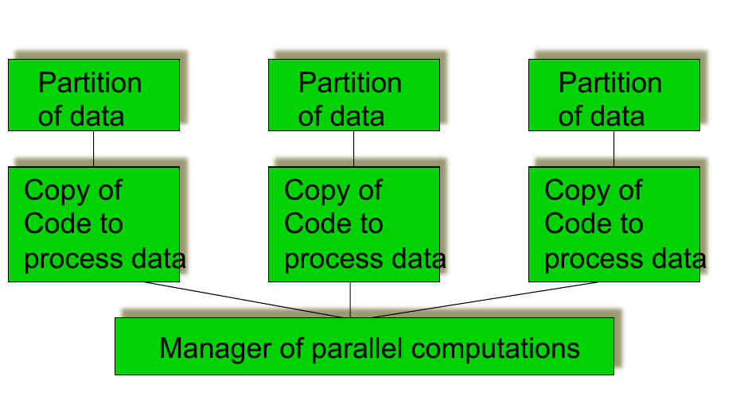

# CSCU9V5 - Concurrent & Distributed Systems

## Mindmap

# Concurrent system classifications & examples

- Inherently concurrent systems

  - real-time systems
    - timing constraints dictated by the environtment of a system
    - system has to respond to external events within a certain time
    - Software monitors & controls aspects of the environment of the system
    - Examples:

      - aircraft systems
      - hospital patient monitoring

  - operating systems
    - Single user and multi-user systems
    - Devices are slow compared to the main processor
      - OS attends to the devices when necessary
      - Other tasks are performed while devices are busy
    - User want to carry out a number of tasks in parallel (lengthy computation + reading e-mail)
    - Running programs of different users in parallel
    - Preemtive and non-premtive scheduling
    - Distributed operating systems

- Potentially concurrent systems

  - benefits from concurrency
  - Used for:
    - large amount of computing (graphics)
    - large amount of data to be processed (simulations)
    - Real-time requirement for the result (voice processing)
    - Hardware is available to run applications in parallel
    - Big data problems
  - Examples
    - eg cooking recipe
      - can be executed  sequentially
      - some steps can be carried out simultaneously
      - ingredients for the next step need to be ready
  - Concurrency solutions (various models)
    - partition data, replicate code (SIMD)
      - 
    - different code on different data (MIMD)
    - pipeline
      - 

# Distrubited systems

## Benefits

|      |      |
| ---- | ---- |
| Economics             | Data sharing   |
| Speed                 | Device sharing |
| Inherent distribution | Communication  |
| Reliability           | Flexibility    |
| Incremental Growth    | Transparency   |

## Challenges

|      |      |
| ---- | ---- |
| Expensive software        | Communcation delay |
| Scalability/Overhead      | Incosistent state  |
| Security                  | No global time     |
| Indepedent fauilure nodes | Heterogeneity      |

# Processes

## About processes

### Execution of a process

- Informally: a program in execution

- computer execute predefined actions

  - Actions are specified by a program
  - Program is a self-contained entity

- Execution of a program required resources

  - e.g.: CPU
    - running programs compete for CPU
    - Programs do not know when they get the CPU

- Actions of CPU and program logic are unrelated

- Conclusion

  - CPU is a normal reusable resource

  - for easy managing of running programs (take the view of the program, not he CPU)

  - Abscration of running programs is required

### Processes - an operating system abstraction

- A program is a static text that specifies a range of actions which have to be executed by one or more processors (passive entity)

- A process is an entity executing the range of actions, which are specified by the program. Its thread of execution is somewhere in the middle between the first and the last of the actions specified by the program (active entity)

  

### Life cycle of a process

- Number of processes > number of CPUs

- Some processes cannot run

- Processes waiting for the resurouces

  - CPU (ready processes)
  - Other resources (blocked processes)

- Operating system provides for liveliness

  - state transitions of a process

#### Multitasking

- The OS virtual machine can (in effect) run several programs at the "same" time

- Efficient usage of CPU:

  - 

#### Process states

  - initiated:	the process is being created

  - running: 	instructions are being executed

  - waiting: 	 	the process is waiting for an event to occur

  - ready: 	 	the process is waiting to be assigned

  - terminated: 	the process has finished execution

#### Lifecycle

- **new** process is created and put in the **ready** queue
- then the use of the CPU is assigned to a ready process, which becomes **running**
- a running process can either **terminate**, suspend while **waiting** for some event to occur or be forced to **release** the CPU (interrupted), for instance because it is being running for too long or because the OS has to load a new page in memory, and hence be put back to the ready queue
- a waiting process can eventually become **read** again, when the event it was waiting for occurs

## Process implementation

### Parts of a process

### Context switch

- when CPU switches to another process, the system must save the state of the old process and load the saved state for the new process
- context-swtich time is overhead; the system does no useful work while switching
- time dependent on hardware support

### Process creation and termination

##### Creation

- Parent process creates children processes, which in turn create other processes, forming a tree of processes

- Resource sharing

  - Parent and children share all resources
  - Children share subset of parent's resources
  - Parent and child share no resources

- Execution

  - Parent and children execute concurrently
  - Parent waits until children terminate

- Address space

  - Child duplicate of parent
  - Child has a program loaded into it

##### Termination

- Process executes last statement and asks the operating system to delete it
  - output data from child to parent
  - process' resources are deallocated by operating system (open files, physical and virtual memory, I/O buffers)
- Parent may terminate execution of children processes
  - child has exceeded allocated resources
  - task assigned to child is no longer required
  - Parent is exiting (eg.: OS may not allow child to continue of its parent terminates)

## Cooperating processes

- **Independent process** 
  - cannot affect or be affected by the execution of another process
- **Cooperating proccess**
  - can affect or be affected by the execution of another process
- Advanteges of process cooperation
  - information sharing (shared files)
  - computation pseed-up (split-up of a task into subtasksk and run them in parallel; note: number of processors)
  - Modulairty (dived a system into separate processes)
  - Convenience (a user has many tasks; eg printing, editing compiling)

### Producer - consumer problem

- Paradigm for cooperating processes, **producer** produces information that is consumed by a **consumer**
  - Examples: printer queue, keyboard buffer
  - Consumer and Producer processes need to be synchronised
  - Buffer may be provided by OS (IPC mechanism) or be explicitly coded by the programmer
    - **unbounded-buffer** places no practical limit on the buffer size
      - producer can always produce elements
      - consumer gets blocked when there are no elements
    - **bounded-buffer** assumes that there is a fixed buffer size
      - producer is blocked when the buffer is full
      - consumer is blocked when the buffer is empty

### Race conditions

- Concurrent access to shared data may result in data inconsistency
- Maintaining data consistency requires machanisms to ensure the orderly execution of cooperating processes
- Example: print spooler
  - User processes put file names into a spooler directory
  - Printer deamon periodically checkes for any new files in the spooler directory (if there are any print the file and remove file name from spooler directory)
  - Directory has infinite number of slots
  - Two globally available variables:
    - **out** points at the next file to be printed
    - **in** points at the next avaiable slot
  - At a time
    - slots 0-3 are empty (files printed)
    - slots 4-6 are full (files to be printed)
  - 
  - Almost simultaneously processes A and B want to print
  - Processes A reads in (value 7) and assigns it to a local variable
  - Processs context switch occurs to process B
  - Process B reads in (value 7) and stores a file in slot 7, updates in to 8
  - Process A runs again, continuing from where it stopped
  - Process A reads local variable and stores a file at slot 7
  - Process B's file erased
  - **RACE CONDITION**

## Summary

- process is an operating system abstraction (program in execution)
- One program may result in many processes
- Processes may be interupted while processing (process states)
- Processes cooperate (communicate)
- Race conditions

